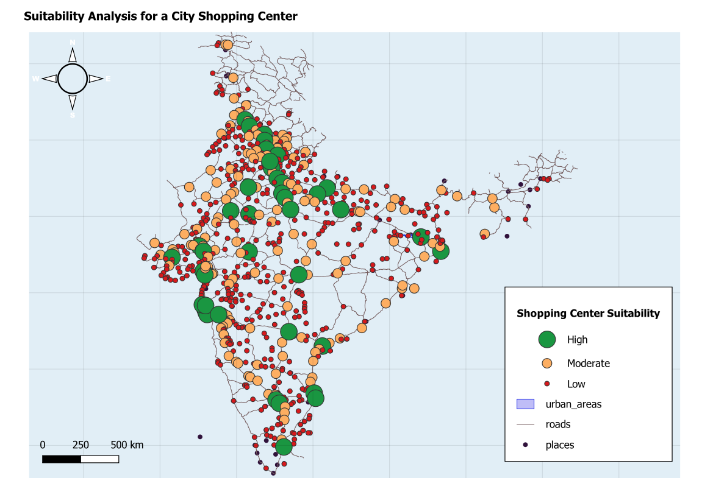

# Suitability Analysis for Shopping Center Project

## Overview
This analysis identifies suitable locations for a new shopping center within
global urbanized areas, using two criteria: population size (demand proxy) and
road accessibility (connectivity proxy). Each urban footprint polygon is scored
and classified into a suitability tier.

---

## Input Layers

  Layer         Type     Features  Key Fields Used
  -----------   -------  --------  ----------------------
  places        Point    211       POP_MAX, NAME
  roads         Line     759       type (Major Highway / Road / Unknown)
  urban_areas   Polygon  677       area_sqkm, geometry

CRS: EPSG:4326 (WGS 84)
Analysis unit: individual urban_areas polygons (677 total → 684 after nearest join)

---

## Methodology

### Step 1 — Population Join (Nearest Neighbour)
Each urban area polygon was joined to the nearest city point in `places` using
native:joinbynearest (1 neighbour, no distance cap). This assigns POP_MAX and
NAME to each urban footprint, representing the population of the closest major
city as a demand proxy.

### Step 2 — Road Accessibility (Spatial Summary Join)
All road features from `roads` that intersect each urban polygon were counted
using native:joinbylocationsummary (intersects predicate, count summary).
This count is stored as `scalerank_count` and reflects general road network
density within the urban extent.

### Step 3 — Major Highway Presence
The `roads` layer was filtered to `type = 'Major Highway'` and the same
summary join was repeated. The count of major highways intersecting each
urban area is stored as `scalerank_count_2` and reflects premium road
connectivity — a stronger attractor for retail traffic.

### Step 4 — Score Normalization
Each criterion was min-max normalized to a 0–1 scale using the observed
maximum across all urban areas:

  Criterion       Max observed  Weight
  --------------  ------------  ------
  POP_MAX         18,978,000    50%
  Road count      12            30%
  Highway count   4             20%

  SUIT_SCORE = (0.50 × POP_SCORE) + (0.30 × ROAD_SCORE) + (0.20 × HW_SCORE)

Population is weighted highest (50%) as retail viability is primarily driven
by catchment population. Road count and highway presence together account for
the remaining 50% as accessibility determinants.

### Step 5 — Suitability Classification
Thresholds calibrated to the observed score distribution
(Min: 0.0007, Median: 0.0345, Max: 0.9196):

  Class     Threshold      Count  Interpretation
  --------  -------------  -----  --------------------------------------------
  High      SUIT_SCORE >= 0.20    41     Strong population + good road access
  Moderate  0.08 – 0.199         159     Acceptable demand or partial access
  Low       < 0.08               477     Low population and/or poor road access

---

## Computed Fields

  Field       Type    Description
  ----------  ------  -------------------------------------------------------
  POP_SCORE   Double  Normalized population score (0–1)
  ROAD_SCORE  Double  Normalized total road count score (0–1)
  HW_SCORE    Double  Normalized major highway count score (0–1)
  SUIT_SCORE  Double  Weighted composite suitability score (0–1)
  SUIT_CLS    String  Suitability class: High / Moderate / Low

---

## Symbology

  Class     Fill Color       Outline
  --------  ---------------  -------
  High      Green  #1a9641   Dark grey, 0.2px
  Moderate  Orange #fdae61   Dark grey, 0.2px
  Low       Red    #d7191c   Dark grey, 0.2px

---

## Output Files

  File                              Description
  --------------------------------  ------------------------------------------
  shopping_center_suitability.gpkg  Scored and classified urban area polygons
  Shopping_Center_Suitability.qgz   QGIS project with symbology applied
  README.md                         This file

---

## Limitations

- Population is sourced from the *nearest* city point, not the city that
  contains or best represents the urban area. Urban areas far from any city
  point may receive a misrepresentative population value.
- Road count is a feature count, not a length or capacity measure. A single
  long highway scores the same as a single short local road.
- The dataset is global and coarse (Natural Earth). Results are indicative at
  a macro/regional planning scale and not suitable for site-level decisions.
- All 677 urban areas qualify as the analysis domain (no urban/rural filter
  was applied beyond the urban_areas layer itself).

---

## Reproducibility
All processing performed in QGIS 3.x via PyQGIS (MCP execution).
Algorithms used: native:joinbynearest, native:joinbylocationsummary,
native:extractbyattribute, QgsVectorFileWriter.
No manual edits were made. Re-running the script against the same inputs
produces identical outputs.

---
Analysis date : May 2026
CRS           : EPSG:4326
Data source   : Natural Earth

---

## Map Preview

